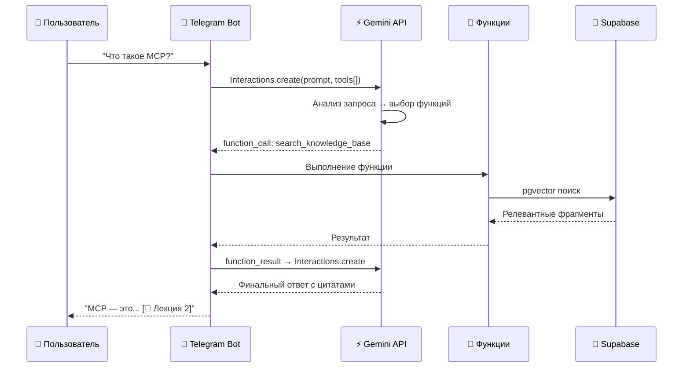
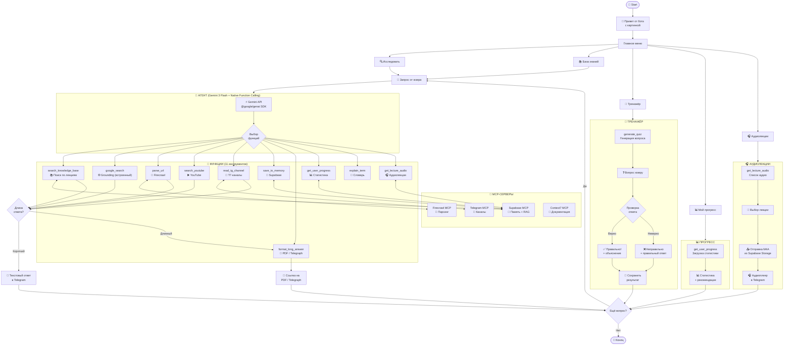

# 🤖 Архитектура бота v3: Gemini API + Native Function Calling

## 📡 Стек технологий

| Компонент | Инструмент | Почему |
|-----------|-----------|--------|
| **Бот** | `telegraf` (Node.js) | Лучшая библиотека для TG-ботов |
| **LLM + Поиск** | Gemini API (`@google/genai`) | Единый API: LLM + Google Search + Function Calling |
| **Модель** | `gemini-3-flash-preview` | Быстрая, бесплатная (1500 запросов/день), мультимодальная |
| **БД + RAG** | Supabase (pgvector) | Векторный поиск, хранение прогресса, память бота |
| **Аудио-хранилище** | Supabase Storage | Хранение M4A-файлов лекций, CDN-раздача |
| **Парсинг** | Firecrawl API | Извлечение текста из любых веб-страниц |
| **YouTube** | YouTube Data API v3 | Поиск видео + субтитры |
| **Хостинг** | Railway | Простой деплой для Node.js-ботов |

> [!TIP]
> **Главное отличие от v2:** Perplexity MCP и OpenRouter заменены на **один** Gemini API — он одновременно служит LLM-мозгом, веб-поисковиком (Grounding) и роутером функций (Function Calling).

---

## 📡 MCP-серверы

| # | MCP-сервер | Зачем нужен | API-ключ |
|---|-----------|-------------|----------|
| 1 | **Supabase** | Память бота: лекции, эмбеддинги, прогресс, история + **Storage для аудио** | Уже есть |
| 2 | **Firecrawl** | Парсинг веб-страниц → чистый текст для LLM | Нужен ключ (firecrawl.dev) |
| 3 | **Telegram** | Чтение ТГ-каналов, мониторинг постов | Через Telegram Bot API |
| 4 | **Context7** | Актуальная документация библиотек | Уже подключён |

> [!IMPORTANT]
> **Что убрали:** Perplexity MCP — его функцию веб-поиска теперь выполняет **Gemini Grounding with Google Search** (встроен в Gemini API, не нужен отдельный сервис).

---

## 🔧 Function Calling — инструменты агента

Gemini API поддерживает нативный **Function Calling** через Interactions API. Агент получает запрос и **сам решает**, какие функции вызвать. Вот полный набор:

### Функция 1: `search_knowledge_base`
**Назначение:** Поиск по лекциям и регламенту (RAG через Supabase pgvector)
```javascript
const searchKnowledgeBase = {
  type: 'function',
  name: 'search_knowledge_base',
  description: 'Ищет ответ в базе знаний: лекции, регламент, словарь терминов. Используй для вопросов по учебным материалам.',
  parameters: {
    type: 'object',
    properties: {
      query: { type: 'string', description: 'Поисковый запрос на естественном языке' },
      top_k: { type: 'number', description: 'Количество результатов (по умолчанию 5)' },
      lecture_filter: { type: 'number', description: 'Фильтр по номеру лекции (опционально)' }
    },
    required: ['query']
  }
};
```

---

### Функция 2: `generate_quiz`
**Назначение:** Генерация вопросов для тренажёра
```javascript
const generateQuiz = {
  type: 'function',
  name: 'generate_quiz',
  description: 'Создаёт тестовый вопрос по указанной теме или лекции. Используй когда пользователь хочет проверить знания.',
  parameters: {
    type: 'object',
    properties: {
      topic: { type: 'string', description: 'Тема вопроса (напр. "GitHub", "MCP")' },
      lecture_number: { type: 'number', description: 'Номер лекции (1-5)' },
      difficulty: { 
        type: 'string', 
        enum: ['easy', 'medium', 'hard'],
        description: 'Уровень сложности' 
      },
      question_type: { 
        type: 'string', 
        enum: ['multiple_choice', 'sequence', 'find_error', 'open'],
        description: 'Тип вопроса' 
      }
    },
    required: ['topic']
  }
};
```

---

### Функция 3: `search_web` (Gemini Google Search Grounding)
**Назначение:** Поиск актуальной информации в интернете
```javascript
// Эта функция реализуется через встроенный инструмент Gemini — google_search grounding.
// НЕ требует отдельного API-ключа или MCP-сервера.

const googleSearchTool = {
  googleSearch: {}
};

// Использование:
const response = await ai.models.generateContent({
  model: 'gemini-3-flash-preview',
  contents: 'Найди свежие статьи про Vibecoding',
  config: {
    tools: [googleSearchTool]
  }
});

// response.text — ответ, подкреплённый результатами поиска
// response.groundingMetadata — метаданные: запросы, источники, цитаты
```

> [!NOTE]
> **Grounding vs Perplexity:** В отличие от Perplexity (отдельный API с отдельной оплатой), Google Search Grounding — встроенная функция Gemini. Модель сама решает, нужен ли поиск, формирует запросы и возвращает ответ с источниками.

---

### Функция 4: `parse_url`
**Назначение:** Парсинг веб-страницы через Firecrawl
```javascript
const parseUrl = {
  type: 'function',
  name: 'parse_url',
  description: 'Извлекает текст из любой веб-страницы. Используй для анализа статей, блогов, документации по URL.',
  parameters: {
    type: 'object',
    properties: {
      url: { type: 'string', description: 'URL страницы для парсинга' },
      format: { 
        type: 'string', 
        enum: ['markdown', 'text'],
        description: 'Формат вывода' 
      }
    },
    required: ['url']
  }
};
```

---

### Функция 5: `search_youtube`
**Назначение:** Поиск и анализ YouTube-видео
```javascript
const searchYoutube = {
  type: 'function',
  name: 'search_youtube',
  description: 'Ищет видео на YouTube. Возвращает список видео с описаниями и субтитрами.',
  parameters: {
    type: 'object',
    properties: {
      query: { type: 'string', description: 'Поисковый запрос' },
      max_results: { type: 'number', description: 'Максимум результатов (по умолчанию 5)' },
      extract_subtitles: { type: 'boolean', description: 'Извлечь субтитры видео' }
    },
    required: ['query']
  }
};
```

---

### Функция 6: `read_tg_channel`
**Назначение:** Чтение постов из ТГ-каналов
```javascript
const readTgChannel = {
  type: 'function',
  name: 'read_tg_channel',
  description: 'Читает последние посты из Telegram-канала. Используй для мониторинга ТГ-контента.',
  parameters: {
    type: 'object',
    properties: {
      channel_id: { type: 'string', description: 'ID или @username канала' },
      limit: { type: 'number', description: 'Количество постов (по умолчанию 10)' },
      search_query: { type: 'string', description: 'Фильтр по тексту (опционально)' }
    },
    required: ['channel_id']
  }
};
```

---

### Функция 7: `save_to_memory`
**Назначение:** Сохранение в долговременную память (Supabase)
```javascript
const saveToMemory = {
  type: 'function',
  name: 'save_to_memory',
  description: 'Сохраняет информацию в долговременную память бота. Используй для заметок, закладок, результатов тестов.',
  parameters: {
    type: 'object',
    properties: {
      type: { 
        type: 'string', 
        enum: ['note', 'quiz_result', 'research', 'bookmark'],
        description: 'Тип записи' 
      },
      content: { type: 'string', description: 'Текст для сохранения' },
      tags: { 
        type: 'array', 
        items: { type: 'string' },
        description: 'Теги для организации (напр. ["MCP", "Лекция 2"])' 
      }
    },
    required: ['type', 'content']
  }
};
```

---

### Функция 8: `format_long_answer`
**Назначение:** Форматирование длинных ответов в документ
```javascript
const formatLongAnswer = {
  type: 'function',
  name: 'format_long_answer',
  description: 'Форматирует длинный ответ в PDF или Telegraph-страницу. Используй когда ответ превышает лимит Telegram-сообщения.',
  parameters: {
    type: 'object',
    properties: {
      content: { type: 'string', description: 'Текст для форматирования' },
      format: { 
        type: 'string', 
        enum: ['telegraph', 'pdf'],
        description: 'Формат документа' 
      },
      title: { type: 'string', description: 'Заголовок документа' }
    },
    required: ['content', 'format', 'title']
  }
};
```

---

### Функция 9: `get_user_progress` *(новая)*
**Назначение:** Получение прогресса пользователя
```javascript
const getUserProgress = {
  type: 'function',
  name: 'get_user_progress',
  description: 'Получает статистику обучения пользователя: пройденные тесты, результаты, слабые темы.',
  parameters: {
    type: 'object',
    properties: {
      lecture_number: { type: 'number', description: 'Фильтр по лекции (опционально)' },
      period: { 
        type: 'string', 
        enum: ['today', 'week', 'month', 'all'],
        description: 'Период статистики' 
      }
    }
  }
};
```

---

### Функция 10: `explain_term` *(новая)*
**Назначение:** Объяснение термина из словаря
```javascript
const explainTerm = {
  type: 'function',
  name: 'explain_term',
  description: 'Ищет термин в словаре курса и даёт подробное объяснение с примерами. Используй для вопросов вида "Что значит...?"',
  parameters: {
    type: 'object',
    properties: {
      term: { type: 'string', description: 'Термин для поиска' },
      with_examples: { type: 'boolean', description: 'Включить практические примеры' }
    },
    required: ['term']
  }
};
```

---

## 🔄 Как работает Gemini Function Calling (Interactions API)

### Жизненный цикл вызова



### Пример кода: полный цикл Function Calling

```javascript
import { GoogleGenAI } from '@google/genai';

const ai = new GoogleGenAI({ apiKey: process.env.GEMINI_API_KEY });

// Регистрация всех инструментов агента
const tools = [
  searchKnowledgeBase,
  generateQuiz,
  parseUrl,
  searchYoutube,
  readTgChannel,
  saveToMemory,
  formatLongAnswer,
  getUserProgress,
  explainTerm,
  getLectureAudio,
  { googleSearch: {} }  // Встроенный веб-поиск
];

async function handleUserMessage(userText) {
  // 1. Отправляем запрос с инструментами
  let interaction = await ai.interactions.create({
    model: 'gemini-3-flash-preview',
    input: userText,
    tools: tools
  });

  // 2. Обрабатываем вызовы функций
  for (const output of interaction.outputs) {
    if (output.type === 'function_call') {
      // Выполняем функцию
      const result = await executeFunction(output.name, output.arguments);

      // 3. Возвращаем результат модели
      interaction = await ai.interactions.create({
        model: 'gemini-3-flash-preview',
        previous_interaction_id: interaction.id,
        input: [{
          type: 'function_result',
          name: output.name,
          call_id: output.id,
          result: JSON.stringify(result)
        }]
      });
    }
  }

  // 4. Возвращаем текстовый ответ
  const textOutput = interaction.outputs.find(o => o.type === 'text');
  return textOutput?.text || 'Не удалось получить ответ.';
}
```

---

## 📐 Обновлённая схема архитектуры



---

## 🔄 Примеры маршрутизации запросов

| Запрос пользователя | Функции, которые вызовет агент |
|---------------------|-------------------------------|
| «Что такое MCP?» | `search_knowledge_base` → ответ из лекций |
| «Что значит "Vibecoding"?» | `explain_term` → объяснение из словаря |
| «Найди свежие статьи про AI» | `google_search` (Grounding) → веб-поиск |
| «Разбери эту статью: [ссылка]» | `parse_url` (Firecrawl) → анализ |
| «Задай мне вопрос по Git» | `generate_quiz` → тренажёр |
| «Что нового в ТГ-канале?» | `read_tg_channel` → последние посты |
| «Найди видео про деплой» | `search_youtube` → субтитры + сводка |
| «Покажи мой прогресс» | `get_user_progress` → статистика |
| «Дай аудио лекции 3» | `get_lecture_audio` → M4A из Supabase Storage → аудиоплеер в TG |
| «Какие аудио есть?» | `get_lecture_audio(list_only)` → список доступных записей |
| «Подробно объясни MCP» | `search_knowledge_base` + `google_search` → `format_long_answer` (PDF) |

> [!IMPORTANT]
> **Агент может вызвать несколько функций за один запрос.** Gemini Interactions API поддерживает цепочки вызовов: результат одной функции может спровоцировать вызов другой.

---

## 🗂️ Необходимые API-ключи

| Ключ | Где получить | Стоимость |
|------|-------------|-----------|
| **Telegram Bot Token** | @BotFather | Бесплатно |
| **Gemini API Key** | ai.google.dev | Бесплатно: 1500 запросов/день (Flash) |
| **Supabase** | supabase.com | Бесплатный план |
| **Firecrawl API Key** | firecrawl.dev | Бесплатно: 500 страниц/мес |
| **YouTube Data API v3** | console.cloud.google.com | Бесплатно: 10 000 запросов/день |

> [!TIP]
> **Экономия vs v2:** убрали 2 платных API (OpenRouter ~$0.01-0.05/запрос, Perplexity ~$0.005/запрос). Gemini Flash бесплатен для прототипирования.

---

## 📋 Сравнение v2 vs v3

| Критерий | v2 (OpenRouter + Perplexity) | v3 (Gemini API) |
|----------|------------------------------|-----------------|
| API-ключей | 5 | 4 (на 1 меньше) |
| Стоимость LLM | ~$0.01-0.05/запрос | Бесплатно (1500/день) |
| Стоимость поиска | ~$0.005/запрос (Perplexity) | Бесплатно (встроен в Gemini) |
| Function Calling | Через OpenRouter | Нативный Gemini Interactions API |
| Веб-поиск | Perplexity MCP (отдельный сервис) | Google Search Grounding (встроен) |
| Мультимодальность | Ограниченная | Полная (текст, изображения, аудио, видео) |
| Аудиолекции | ❌ Нет | ✅ M4A через Supabase Storage |
| Количество функций | 8 | 11 (+get_user_progress, +explain_term, +get_lecture_audio) |

---

## 🎧 Как загрузить аудиофайлы M4A в Supabase Storage

### Способ 1: Через Supabase Dashboard (самый простой)

1. Откройте [Supabase Dashboard](https://supabase.com/dashboard) → ваш проект
2. В боковом меню нажмите **Storage**
3. Нажмите **New bucket** → введите имя: `audio-lectures`
4. Отметьте **Public bucket** (чтобы бот мог отдавать файлы без авторизации)
5. Нажмите **Create bucket**
6. Внутри бакета создайте папки по структуре:
   ```
   audio-lectures/
   ├── lectures/
   │   ├── lecture_1/
   │   │   ├── lecture_1.m4a
   │   │   └── lecture_1_part2.m4a  (если разбита на части)
   │   ├── lecture_2/
   │   │   └── lecture_2.m4a
   │   ├── lecture_3/
   │   │   └── lecture_3.m4a
   │   ├── lecture_4/
   │   │   └── lecture_4.m4a
   │   └── lecture_5/
   │       └── lecture_5.m4a
   ```
7. Нажмите **Upload files** → перетащите ваши M4A-файлы

> [!TIP]
> **Лимиты бесплатного плана Supabase Storage:** 1 ГБ хранилища, 2 ГБ трафика/мес. Для 5 лекций по ~15-30 мин в M4A (~5-15 МБ каждая) этого более чем достаточно.

### Способ 2: Через код (Node.js Supabase SDK)

Если хотите автоматизировать загрузку:

```javascript
import { createClient } from '@supabase/supabase-js';
import fs from 'fs';

const supabase = createClient(
  process.env.SUPABASE_URL,
  process.env.SUPABASE_SERVICE_KEY  // Используйте service_role key для загрузки
);

async function uploadAudio(lectureNumber, filePath) {
  const fileBuffer = fs.readFileSync(filePath);
  const fileName = `lectures/lecture_${lectureNumber}/lecture_${lectureNumber}.m4a`;

  const { data, error } = await supabase.storage
    .from('audio-lectures')
    .upload(fileName, fileBuffer, {
      contentType: 'audio/mp4',   // MIME-тип для M4A
      upsert: true                // Перезаписать если файл уже есть
    });

  if (error) throw error;

  // Получаем публичную ссылку
  const { data: urlData } = supabase.storage
    .from('audio-lectures')
    .getPublicUrl(fileName);

  console.log(`✅ Загружено: ${urlData.publicUrl}`);
  return urlData.publicUrl;
}

// Пример: загрузить лекцию 3
await uploadAudio(3, './audio/lecture_3.m4a');
```

### Структура именования файлов

| Файл | Путь в Supabase Storage |
|------|------------------------|
| Лекция 1, полная | `lectures/lecture_1/lecture_1.m4a` |
| Лекция 2, часть 1 | `lectures/lecture_2/lecture_2_part1.m4a` |
| Лекция 2, часть 2 | `lectures/lecture_2/lecture_2_part2.m4a` |
| Лекция 3, полная | `lectures/lecture_3/lecture_3.m4a` |
